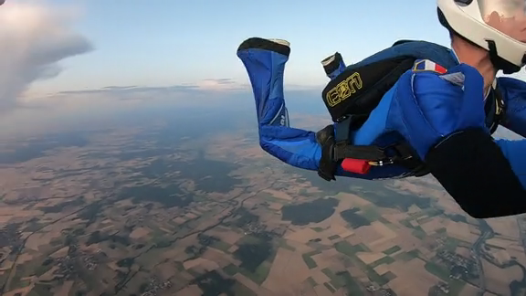
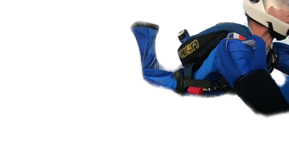
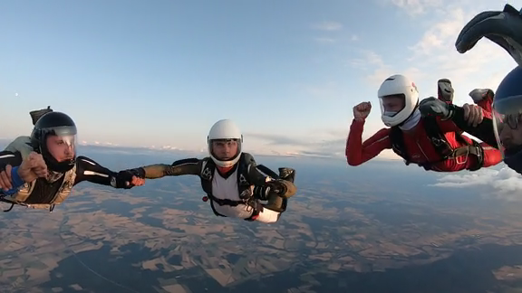
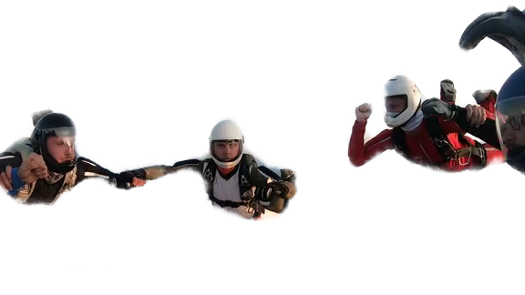

# Video Background Eraser

## Result Preview
This C++ pipeline combines two DCNNs and some computer vision preprocessing in order to remove the background of images from a video.<br/>
The output is a directory of RGBA images.
The alpha component of background pixels are set to 0.<br/>
The contour of the foreground objects have progressive alpha values to blend them with new backgrounds.<br/>
<br/>
<br/>


## Requirements
Tested on Ubuntu 18.04.

Direct dependencies: <br/>
* TCLAP
  * sudo apt install libtclap-dev
* libtorch
  * (Cuda enabled) https://download.pytorch.org/libtorch/cu101/libtorch-cxx11-abi-shared-with-deps-1.4.0.zip
  * (without Cuda) https://download.pytorch.org/libtorch/cpu/libtorch-cxx11-abi-shared-with-deps-1.4.0%2Bcpu.zip <br/>
* Opencv 4.2.0
  * built from sources (https://github.com/opencv/opencv/tree/4.2.0 and contribs https://github.com/opencv/opencv_contrib/tree/4.2.0).

## Components
The pipeline is composed by :<br/>
* Semantic Segmentation using DeepLabV3
  * see my other repository https://github.com/jnkl314/DeepLabV3FineTuning
  * weights were fine-tuned for skydiver segmentation, and frozen with PyTorch JIT Tracing
* Optical flow to track pixels of foreground objects over time
* Trimap generation using morpho math
* Deep Image Matting to improve alpha on objects contour
  * pretrained weights come from https://github.com/foamliu/Deep-Image-Matting-PyTorch
  * also frozen using PyTorch JIT Tracing
  
## Build
```bash
cd ./samples/
mkdir build
cd build
cmake ../VideoBackgroundEraser/
make -j8
```

## Launch Example
```bash
#!/bin/bash
BIN=build/VideoBackgroundEraser

INPUT=../data/YourVideo.mp4
OUTPUT=../data/results/
OUTPUT2=../data/results_grid/
MODEL1=../data/best_deeplabv3_skydiver.pt
MODEL2=../data/best_DeepImageMatting.pt
BG="-b 0"
CUSTOM="--useCuda --hideDisplay -t"

OPTIONS="-m ${MODEL1} -n ${MODEL2} -i ${INPUT} -o ${OUTPUT} -p ${OUTPUT2} ${BG} ${CUSTOM}"

echo $BIN $OPTIONS
$BIN $OPTIONS
```


## Usage
```bash
USAGE: 

 VideoBackgroundEraser  [-r <float>]
                        [-t]
                        [-b <list<int>>] ... 
                        -n <string> -m <string>
                        [-p <string>]
                        [-o <string>]
                        [--hideDisplay]
                        [-c]
                        -i <string>
                        [--] [--version] [-h]
  Where: 

   -r <float>,  --imageMatting_scale <float>
     Rescale for Deep Image Matting

   -t,  --enable_temporalManagement
     Enable temporal management of scene to improve accuracy between
     frames. Might not work well for video where the background is moving

   -b <list<int>>,  --background_classId_list <list<int>>  (accepted
      multiple times)
     IDs of the background in the model

   -n <string>,  --DeepImageMattingModelPath <string>
     (required)  Path to a PyTorch JIT binary .pb containing the trained
     model DeepImageMatting

   -m <string>,  --DeepLabV3ModelPath <string>
     (required)  Path to a PyTorch JIT binary .pb containing the trained
     model DeepLabV3

   -p <string>,  --outputPathGrid <string>
     Path to a directory to save rgb result with grid

   -o <string>,  --outputPath <string>
     Path to a directory to save rgba result

   --hideDisplay
     Hide display of source image and result

   -c,  --useCuda
     Use Cuda for inference

   -i <string>,  --inputPath <string>
     (required)  Path to video or a directory+pattern
```

## FFMPEG Utility
Once the background is replaced with the tool/code of your choice, ffmpeg can be used to compress the images in a video file :
```bash
ffmpeg -i your_result/%08d.png -c:v libx264 -crf 20 -pix_fmt yuv420p your_result.mp4
```
